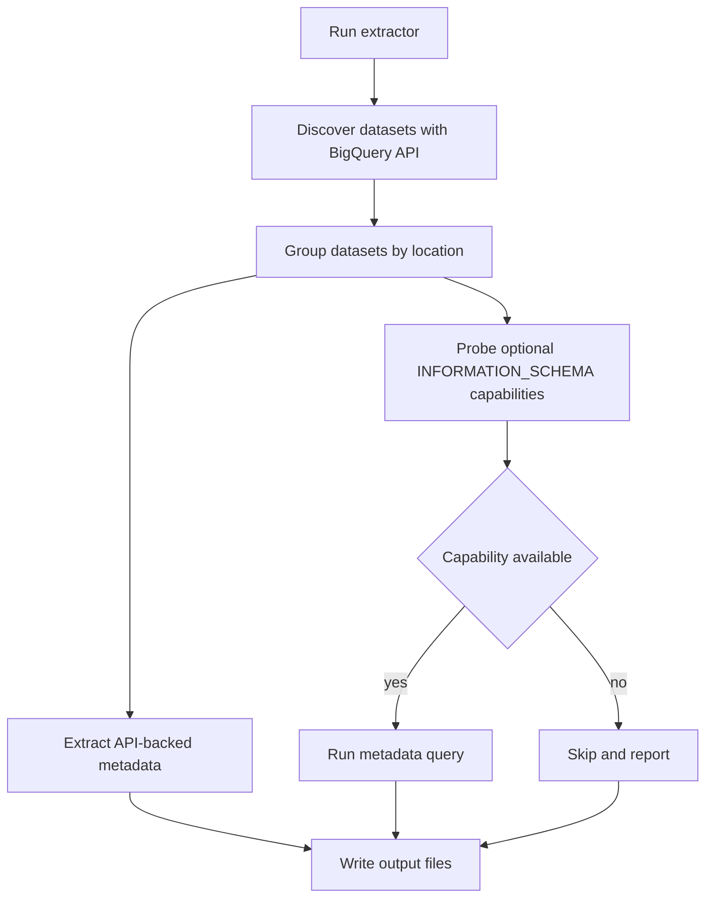

# BigQuery Metadata Extraction

This repository contains a discovery-first BigQuery metadata extractor. You point it at a GCP project, and it inventories what it can find through the BigQuery API first, then uses scoped `INFORMATION_SCHEMA` queries for metadata the API does not expose directly.

The main use case is understanding an unfamiliar warehouse without hardcoding dataset names, object families, or locations ahead of time.

## What It Does

- Discovers datasets in a project and groups them by location.
- Extracts API-backed metadata for datasets, tables, views, routines, and BigQuery ML models.
- Probes optional metadata capabilities such as table DDLs and query history rollups before trying to extract them.
- Writes structured output to a timestamped directory in `json` or `csv`.
- Skips capabilities it cannot access and reports them at the end instead of failing the whole run.

## When To Use It

Use this when you need to:

- inventory a BigQuery project quickly
- capture table and view definitions
- collect routine and model metadata
- summarize recent query activity when you have access to `INFORMATION_SCHEMA.JOBS_BY_PROJECT`
- work across multiple BigQuery locations without building separate queries by hand

## How It Works



In practice, that means:

- dataset discovery happens first
- region-aware metadata queries run in the correct BigQuery location
- DDLs and jobs-derived outputs are only extracted if the probe succeeds
- some capabilities can fall back from region scope to dataset scope when region-level access is not available

## Prerequisites

- Python 3.9+
- [`uv`](https://github.com/astral-sh/uv)
- [`gcloud`](https://cloud.google.com/sdk/docs/install)
- access to the target BigQuery project

Authenticate with Google Cloud before running the extractor:

```bash
gcloud auth login
gcloud auth application-default login
```

You will usually want the target project to have the BigQuery API enabled. If you plan to use the optional local test setup in this repo, enable IAM too:

```bash
gcloud services enable bigquery.googleapis.com iam.googleapis.com
```

## Install

```bash
uv sync
```

## Run Extraction

Start with a dry run. It performs discovery and capability probing without writing any files:

```bash
uv run python scripts/extract.py --project <project-id> --dry-run
```

Run the full extraction once the dry run looks right:

```bash
uv run python scripts/extract.py --project <project-id>
```

By default, output is written to `output/YYYYMMDD_HHMMSS/`.

## Useful Examples

Extract everything the current credentials can access:

```bash
uv run python scripts/extract.py --project <project-id>
```

Only scan specific locations:

```bash
uv run python scripts/extract.py --project <project-id> --locations us,eu
```

Only emit table metadata and DDLs:

```bash
uv run python scripts/extract.py --project <project-id> --families tables --sources tables.ddls
```

Only collect jobs-derived outputs for the last 7 days:

```bash
uv run python scripts/extract.py --project <project-id> --families jobs --days 7
```

Limit the run to a few known datasets:

```bash
uv run python scripts/extract.py --project <project-id> --datasets raw,analytics
```

Write CSV files to a fixed directory:

```bash
uv run python scripts/extract.py --project <project-id> --format csv --output-dir output/latest
```

Print only the output directory on success:

```bash
uv run python scripts/extract.py --project <project-id> --quiet
```

## Important Flags

| Flag | What it does |
| --- | --- |
| `--project` | Required. GCP project to extract from. |
| `--locations us,eu,...` | Restricts discovery and metadata queries to specific BigQuery locations. |
| `--region <location>` | Deprecated single-location alias for older workflows. |
| `--datasets raw,analytics` | Limits extraction to specific datasets. |
| `--families datasets,tables,routines,models,jobs` | Limits which object families are emitted. |
| `--exclude-families ...` | Excludes object families you do not want. |
| `--sources tables.ddls,jobs.query_logs,...` | Limits optional non-API metadata capabilities. |
| `--exclude-sources ...` | Skips specific capabilities. |
| `--days 30` | Sets the jobs lookback window. Only affects jobs-derived outputs. |
| `--max-rows 200000` | Caps rows returned by capability queries. |
| `--format json` or `--format csv` | Chooses output format. |
| `--output-dir <path>` | Writes files to a specific directory instead of the default timestamped path. |
| `--include-hidden-datasets` | Includes hidden datasets in API-backed discovery. |
| `--dry-run` | Performs discovery and capability probing without writing files. |
| `--quiet` | Prints only the output directory path on success. |

`--sources` only affects capability-based outputs such as DDLs and jobs rollups. If you also want to suppress unrelated API-backed files, combine it with `--families`.

Run `uv run python scripts/extract.py --help` for the full CLI.

## Output

The extractor writes one file per family or capability. In `json` mode, each file contains a JSON array. In `csv` mode, nested values are serialized as JSON strings where needed.

### API-backed files

- `datasets.json`
- `tables.json`
- `routines.json`
- `models.json`

### Capability files

- `tables.ddls.json`: DDL statements from `INFORMATION_SCHEMA.TABLES`
- `jobs.query_logs.json`: recent query jobs with text, timing, bytes, labels, and source classification
- `jobs.query_sources.json`: breakdown of query sources such as ad hoc, scheduled, batch, and service account
- `jobs.frequent_queries.json`: top repeated queries grouped by normalized query hash
- `jobs.table_access.json`: table access rollups from query history
- `jobs.user_stats.json`: per-user query activity and resource usage

When a capability query runs, each row is augmented with a `location` field so you can tell which BigQuery region it came from.

## Reading The Results

A typical first pass looks like this:

```bash
LATEST_OUTPUT="$(ls -td output/* | head -1)"
ls -lh "$LATEST_OUTPUT"
python3 -m json.tool "$LATEST_OUTPUT/datasets.json"
python3 -m json.tool "$LATEST_OUTPUT/tables.json" | head -50
```

If DDL extraction is available, inspect that next:

```bash
python3 -m json.tool "$LATEST_OUTPUT/tables.ddls.json" | head -50
```

If jobs capabilities are available, inspect those next:

```bash
python3 -m json.tool "$LATEST_OUTPUT/jobs.query_sources.json"
python3 -m json.tool "$LATEST_OUTPUT/jobs.user_stats.json"
```

## Permissions And Behavior Notes

- The extractor uses the official BigQuery client first and only relies on `INFORMATION_SCHEMA` where it adds something the API does not expose directly.
- Jobs-derived outputs require access to `INFORMATION_SCHEMA.JOBS_BY_PROJECT`, which typically means `bigquery.jobs.listAll`. Without that access, the run still succeeds and those capabilities are reported as unavailable.
- Hidden datasets are excluded by default.
- Location matters. BigQuery metadata queries run in the dataset's location, and `--locations` must match actual dataset locations.
- DDL extraction can fall back to dataset-scoped metadata queries when region-scoped access is not available.

## Optional Test Setup

The Terraform and seed scripts in this repo exist so you can exercise the extractor against a disposable BigQuery setup. You do not need them if you already have a project to inspect.

The optional test path creates three datasets, loads sample tables and rows, and runs a small set of queries so `INFORMATION_SCHEMA.JOBS_BY_PROJECT` has something to report on.

Provision the test environment:

```bash
cd terraform
cp terraform.tfvars.example terraform.tfvars
# edit terraform.tfvars and set project_id
terraform init
terraform apply
```

Seed sample data and query history:

```bash
cd ../scripts
./seed_data.sh <project-id>
./seed_queries.sh <project-id> [region]
```

`seed_data.sh` truncates the seeded tables before inserting rows, so it is safe to rerun.

The second argument to `seed_queries.sh` must match the dataset location. If you omit it, the script uses `US`.

Run the extractor against that test project:

```bash
cd ..
uv run python scripts/extract.py --project <project-id>
```

Tear the test environment down when you are done:

```bash
cd terraform
terraform destroy
```
